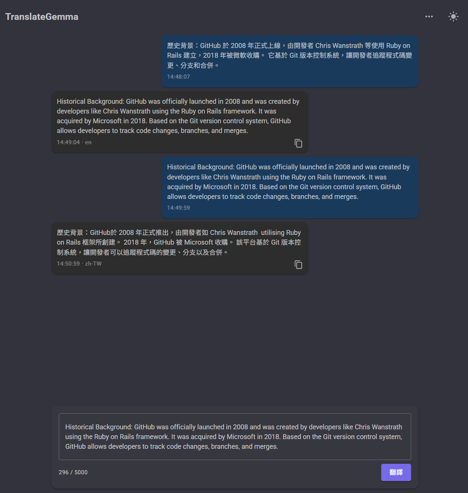

# TranslateGemma 翻譯網頁服務

基於 Google TranslateGemma 模型的本地翻譯網頁服務，提供類似 ChatGPT 的對話式翻譯介面。

## 📋 專案特色

- 🌐 **前端**：Blazor WebAssembly (.NET 9) + MudBlazor，完全在瀏覽器運行
- ⚡ **後端**：FastAPI (Python)，高效能非同步 API，支援 SSE 串流
- 🤖 **模型**：TranslateGemma 4B / 12B，支援繁體中文 ↔ 英文雙向翻譯
- 🔌 **雙後端架構**：`local`（行程內直接載入）或 `ollama`（REST API 呼叫外部 Ollama 服務），可於 `config.yaml` 自由切換
- 🎯 **簡單設計**：無帳號管理、無持久化，關閉即清除
- 🖥️ **多裝置支援**：NVIDIA CUDA、Apple MPS、CPU

## � 操作介面截圖



## �🚀 快速開始

### 前置需求

- Python **3.13**（建議，支援 PyTorch CUDA wheel）；3.10+ 可用但不支援 GPU 推論，請勿使用 3.14
- .NET 9 SDK
- Podman 或 Docker（容器部署）
- （選用）NVIDIA GPU with CUDA 或 Apple Silicon Mac（加速推論）

### 1. 下載模型

由於模型檔案過大，需手動下載至專案 `models/` 目錄：

#### 方法一：使用 Hugging Face CLI（推薦）

```bash
# 安裝 Hugging Face CLI
pip install huggingface-hub[cli]

# 登入 Hugging Face（需先申請 Gemma 授權）
huggingface-cli login

# 下載 4B 模型
huggingface-cli download google/translategemma-4b-it \
  --local-dir models/Translategemma-4b-it \
  --local-dir-use-symlinks False

# 下載 12B 模型
huggingface-cli download google/translategemma-12b-it \
  --local-dir models/Translategemma-12b-it \
  --local-dir-use-symlinks False
```

#### 方法二：使用 Git LFS

```bash
# 安裝 Git LFS
git lfs install

# 克隆模型倉庫
cd models
git clone https://huggingface.co/google/translategemma-4b-it Translategemma-4b-it
git clone https://huggingface.co/google/translategemma-12b-it Translategemma-12b-it
```

### 2. 設定檔

複製範例設定檔並根據需求調整：

```bash
cp config.example.yaml config.yaml
```

編輯 `config.yaml`，依目標後端二擇一：

**方案 A：Local 後端**（行程內直接載入，需先下載模型檔）

```yaml
model:
  backend: "local"              # 預設值，向下相容
  name: "4b"                    # 選擇 "4b" 或 "12b"
  path: "Translategemma-4b-it"  # 模型目錄名稱（相對於 base_path）
  device: "auto"                # 自動偵測 cuda → mps → cpu
  dtype: "auto"                 # 自動選擇精度 CUDA/MPS → bfloat16, CPU → float32
```

**方案 B：Ollama 後端**（呼叫外部 Ollama 服務，無需在本機下載模型）

```yaml
model:
  backend: "ollama"
  ollama_base_url: "http://localhost:11434"
  ollama_model: "translategemma:4b"
```

* 使用 Ollama 後端前，請先安裝 [Ollama](https://ollama.com) 並執行：

```bash
ollama pull translategemma:4b
```

* **GPU 使用注意**：`pip install torch` 預設可能只安裝 CPU 版本（可用 `python -c "import torch; print(torch.__version__)"` 確認，若輸出含 `+cpu` 表示 CPU 版）。
  * 需另行安裝 CUDA-enabled 版本：
    ```bash
    # CUDA 12.4（適用驅動版本 ≥ 550.x，如 RTX 4060）
    pip install torch --index-url https://download.pytorch.org/whl/cu124
    ```
 * 完整安裝指令請至 https://pytorch.org/get-started/locally/ 選擇。

 * **dtype 建議**：8GB GPU（如 RTX 4060）請使用 `dtype: "float16"`；`float32` 會導致 OOM。

### 3. （選用）啟用 GPU 容器加速

容器內使用 NVIDIA GPU 推論需在**主機**安裝 NVIDIA Container Toolkit，讓 Podman / Docker 能將 GPU 裝置傳遞給容器；`config.yaml` 同時需設定 `device: "cuda"`。

> 若無 GPU 或不需要 GPU 加速，可跳過此節，直接執行 `podman-compose up` 即可以 CPU / MPS 模式執行。GPU 設定已獨立至 `docker-compose.gpu.yaml`，僅 Windows NVIDIA 環境才需帶入。

#### Linux 主機

```bash
# 1. 安裝 NVIDIA Container Toolkit（Ubuntu / Debian）
curl -fsSL https://nvidia.github.io/libnvidia-container/gpgkey | \
  sudo gpg --dearmor -o /usr/share/keyrings/nvidia-container-toolkit-keyring.gpg
curl -s -L https://nvidia.github.io/libnvidia-container/stable/deb/nvidia-container-toolkit.list | \
  sed 's#deb https://#deb [signed-by=/usr/share/keyrings/nvidia-container-toolkit-keyring.gpg] https://#g' | \
  sudo tee /etc/apt/sources.list.d/nvidia-container-toolkit.list
sudo apt-get update && sudo apt-get install -y nvidia-container-toolkit

# 2. 產生 CDI 設定（Podman 必要）
sudo nvidia-ctk cdi generate --output=/etc/cdi/nvidia.yaml

# 3.（若使用 Docker）設定 Docker runtime 並重啟
sudo nvidia-ctk runtime configure --runtime=docker
sudo systemctl restart docker

# 4. 驗證 GPU 可被容器存取
# Podman：
podman run --rm --device nvidia.com/gpu=all docker.io/nvidia/cuda:12.4.1-base-ubuntu22.04 nvidia-smi
# Docker：
docker run --rm --gpus all nvidia/cuda:12.4.1-base-ubuntu22.04 nvidia-smi
```

#### Windows（Podman Desktop + WSL2）

Podman Desktop for Windows 透過 `podman machine`（WSL2 虛擬機）執行容器，需進入機器內安裝：

```powershell
# 1. Windows 主機安裝 NVIDIA 驅動 ≥ 470.x（已含 WSL2 GPU 支援）
#    下載：https://www.nvidia.com/Download/index.aspx

# 2. 進入 podman machine
podman machine ssh

# ── 以下在 podman machine 內執行 ──────────────────────────────────
# 3. 安裝 nvidia-container-toolkit（預設 Fedora CoreOS 使用 rpm-ostree）
sudo rpm-ostree install nvidia-container-toolkit
sudo systemctl reboot   # 套用後重開機

# 4. 重新進入，產生 CDI 設定
# （在 Windows 端）
podman machine ssh
sudo nvidia-ctk cdi generate --output=/etc/cdi/nvidia.yaml

# 5. 驗證
podman run --rm --device nvidia.com/gpu=all docker.io/nvidia/cuda:12.4.1-base-ubuntu22.04 nvidia-smi
exit
```

> **版本需求**：Podman Desktop ≥ 1.3、Podman Engine ≥ 4.7 才支援 GPU 直通。

#### 設定 config.yaml 啟用 CUDA

```yaml
model:
  device: "cuda"   # 明確指定使用 NVIDIA GPU
  dtype: "float16" # 8 GB VRAM（如 RTX 4060）建議使用 float16
```

### 4. 本地開發

> 以下啟用 hot-reload，**僅供開發使用**，不建議用於正式服務。

#### 後端（支援程式碼異動自動重啟）

**Linux / macOS：**

```bash
# 方式一：從專案根目錄以 PYTHONPATH 執行（推薦）
PYTHONPATH=. .venv/bin/uvicorn backend.src.main:app --host 0.0.0.0 --port 8000 --reload

# 方式二：進入虛擬環境後以 --app-dir 執行
source .venv/bin/activate
uvicorn src.main:app --app-dir backend --host 0.0.0.0 --port 8000 --reload
```

**Windows PowerShell：**

```powershell
$env:PYTHONPATH="."; .venv\Scripts\uvicorn.exe backend.src.main:app --host 0.0.0.0 --port 8000 --reload
```

> **Ollama 後端開發提示**：將 `config.yaml` 的 `model.backend` 設為 `"ollama"` 後啟動，可跳過本地模型載入（省去數分鐘等待），適合只需驗證 API / 前端行為的開發情境。

#### 前端（dotnet run，支援 Hot Reload）

```bash
dotnet run --project frontend/frontend.csproj
```

> **BackendUrl 自動套用**：`dotnet run` 預設使用 `Development` 環境，會自動讀取 `frontend/wwwroot/appsettings.Development.json` 覆蓋 `appsettings.json` 的佔位符，`BackendUrl` 固定指向 `http://localhost:8000`，無需額外設定。

開啟瀏覽器：http://localhost:5000（`dotnet run` 預設埠）

---

### 5. 正式部署

依環境選擇對應方式：

| 方式 | 前端 | 後端 | 適用環境 |
|------|------|------|---------|
| **容器（Podman / Docker）** | 容器（nginx） | 容器 | Linux、Windows、macOS（MPS 除外） |
| **IIS + 本機後端** | IIS 靜態網站 | 本機執行 | Windows（現有 IIS 伺服器） |
| **macOS MPS** | 容器（nginx） | 本機執行 | Apple Silicon Mac |

---

#### 方式 A：容器部署（Podman / Docker）

> Podman / Docker 在 macOS 透過 Linux VM 執行容器，**Metal / MPS 無法穿透**，macOS 請改用下方「方式 C」。

**步驟一：設定後端 URL 環境變數**

容器啟動時會自動將 `appsettings.json` 內的 `${BACKEND_URL}` 替換為此變數。若省略，前端會動態將 `localhost` 替換為瀏覽器所連的主機 IP。

**Linux / macOS：**

```bash
export BACKEND_URL=http://10.1.1.99:8000
```

**Windows PowerShell：**

```powershell
# 僅當前視窗有效（關閉後消失）
$env:BACKEND_URL = "http://10.1.1.99:8000"
```

若需永久儲存，改用以下指令：

```powershell
# 使用者層級（不需系統管理員）
[System.Environment]::SetEnvironmentVariable("BACKEND_URL", "http://10.1.1.99:8000", "User")

# 系統層級（需系統管理員，所有使用者皆生效）
[System.Environment]::SetEnvironmentVariable("BACKEND_URL", "http://10.1.1.99:8000", "Machine")
```

* **注意**：`SetEnvironmentVariable` 寫入的是 Windows 登錄檔，**不會立即注入目前已開啟的終端**。需重新開啟 PowerShell 才能生效，或在目前視窗手動載入：
  ```powershell
  $env:BACKEND_URL = [System.Environment]::GetEnvironmentVariable("BACKEND_URL", "User")
  ```

* 確認設定是否生效：

```powershell
echo $env:BACKEND_URL
```

**步驟二：啟動服務**

容器建置時自動選擇以下其中一種安裝策略：

| 策略 | 觸發條件 | 說明 |
|------|---------|------|
| **A：離線安裝** | `backend/pip-cache/` 有 `.whl` 檔 | 直接使用預下載的 wheel，無需網路 |
| **B：線上安裝** | `backend/pip-cache/` 為空 | 從 PyPI / PyTorch 下載，Podman Build cache 自動加速後續建置 |

**Linux / macOS（或無 GPU）— 直接執行：**

```bash
# CPU 模式，或 Linux + NVIDIA GPU（需已安裝 NVIDIA Container Toolkit）
podman-compose up -d
```

第一次建置會從網路下載套件；Podman 會自動快取，後續建置不需重新下載。

**Windows + NVIDIA GPU：**

```powershell
# 方式一（推薦）：自動管理 pip-cache，確保離線可用
# pip-cache 為空時先在 Linux 容器內下載正確平台的 wheel，再 build + up
.\build-backend.ps1             # CUDA 12.4（預設，適用 RTX 系列）
.\build-backend.ps1 -CPU        # CPU-only torch

# 方式一-2（一鍵正式部署）：前端 build + 服務啟動 + 健康檢查
.\deploy-production.ps1
.\deploy-production.ps1 -CPU
.\deploy-production.ps1 -BackendUrl "http://10.1.1.99:8000"

# 方式二：直接呼叫 podman-compose（pip-cache 空時需網路）
podman-compose -f docker-compose.yaml -f docker-compose.gpu.yaml up -d
```

**程式碼變更後（特別是 backend/src）如何正確重編譯與重啟：**

僅執行 `podman-compose up -d` 不會保證既有容器被替換，可能仍沿用舊容器，導致 API 回應看起來像沒更新。

建議使用以下流程：

```powershell
# 1) 先重建後端 image（一般情況）
podman-compose -f docker-compose.yaml -f docker-compose.gpu.yaml build backend

# 2) 強制重建並替換執行中的後端容器
podman-compose -f docker-compose.yaml -f docker-compose.gpu.yaml up -d --force-recreate backend

# 3) 驗證新設定是否生效
curl -s http://localhost:8000/api/config
```

若你要一次重建並啟動所有服務，可用：

```powershell
podman-compose -f docker-compose.yaml -f docker-compose.gpu.yaml up -d --build --force-recreate
```

若懷疑 image build cache 影響（較少見），再使用：

```powershell
# 強制不使用快取重建後端 image
podman-compose -f docker-compose.yaml -f docker-compose.gpu.yaml build --no-cache backend

# 重新建立後端容器
podman-compose -f docker-compose.yaml -f docker-compose.gpu.yaml up -d --force-recreate backend
```

若仍異常，可清理未使用的建置快取與懸空 image（不會刪除正在使用的容器）：

```powershell
podman image prune -f
podman builder prune -f
```

> **為何需要 `build-backend.ps1`**：在 Windows 執行 `pip download` 只會下載 Windows wheel（`win_amd64`），Linux 容器無法使用。`build-backend.ps1` 會先在 `python:3.11-slim` Linux 容器內下載 wheel（透過 volume mount 寫回 `backend/pip-cache/`），確保取得正確平台的套件（含 `uvloop` 等 Linux-only 套件）。

> **GPU 直通說明**：GPU 設定已獨立至 `docker-compose.gpu.yaml`，預設不帶入，避免非 NVIDIA 環境因找不到 CDI 裝置而報錯。

Docker Compose 同理：

```bash
docker-compose up -d
docker-compose -f docker-compose.yaml -f docker-compose.gpu.yaml up -d
```

**重新建置前端 image（程式碼變更後）：**

```bash
# 一般重建
podman-compose build frontend
podman-compose up -d frontend

# 不使用快取強制重建
podman-compose build --no-cache frontend
podman-compose up -d frontend
```

**Windows + Podman Desktop + WSL portproxy 設定（若區域網路無法連線）：**

Podman Desktop 透過 WSL2 執行，`wslrelay` 可能只監聽 `127.0.0.1`，需在 Windows 建立 portproxy：

```powershell
# 確保 IP Helper 服務已啟用
Set-Service iphlpsvc -StartupType Automatic
Start-Service iphlpsvc

# 將區域網路 IP 轉發到 localhost
netsh interface portproxy add v4tov4 listenaddress=10.1.1.99 listenport=5000 connectaddress=127.0.0.1 connectport=5000
netsh interface portproxy add v4tov4 listenaddress=10.1.1.99 listenport=8000 connectaddress=127.0.0.1 connectport=8000
```

檢查與刪除：

```powershell
netsh interface portproxy show all
netsh interface portproxy delete v4tov4 listenaddress=10.1.1.99 listenport=5000
netsh interface portproxy delete v4tov4 listenaddress=10.1.1.99 listenport=8000
```

---

#### 方式 B：IIS 部署（Windows，前端靜態檔案）

前端為純靜態 Blazor WASM，可直接由 IIS 服務，後端仍需在本機執行。

**前置需求：**
- IIS 已安裝，且已安裝 [URL Rewrite Module](https://www.iis.net/downloads/microsoft/url-rewrite)（SPA 路由必要）
- .NET 9 SDK（用於 publish）

**步驟一：Publish 前端**

```powershell
dotnet publish frontend/frontend.csproj -c Release -o frontend/publish
```

輸出在 `frontend/publish/wwwroot/`，`dotnet publish` 會自動產生 `web.config`（含 URL Rewrite 規則）。

**步驟二：設定 BackendUrl**

publish 後 `appsettings.json` 內仍為 `${BACKEND_URL}` 佔位符，需手動替換：

```powershell
(Get-Content frontend\publish\wwwroot\appsettings.json) `
  -replace '\$\{BACKEND_URL\}', 'http://10.1.1.99:8000' |
  Set-Content frontend\publish\wwwroot\appsettings.json
```

> 若前後端在同一台機器，後端由 `localhost` 存取，本步驟可跳過（`Program.cs` 有 fallback 邏輯）。

**步驟三：IIS 網站設定**

1. IIS 管理員 → 新增網站（或使用現有網站）
2. 實體路徑：`D:\Project\GoogleTranslategemma\frontend\publish\wwwroot`
3. 繫結：設定對應的 IP / Port（例如 `10.1.1.99:5000`）
4. 確認 `web.config` 存在（`dotnet publish` 自動產生）

**步驟四：啟動後端**

```powershell
$env:PYTHONPATH="."; .venv\Scripts\uvicorn.exe backend.src.main:app --host 0.0.0.0 --port 8000 --workers 1
```

> 後端建議以 Windows 服務或工作排程器設定開機自動啟動。

**Windows 防火牆（允許區域網路存取）：**

```powershell
# 以系統管理員身分執行
netsh advfirewall firewall add rule name="TranslateGemma Frontend" dir=in action=allow protocol=TCP localport=5000 profile=private,domain
netsh advfirewall firewall add rule name="TranslateGemma Backend" dir=in action=allow protocol=TCP localport=8000 profile=private,domain
```

---

#### 方式 C：macOS Apple Silicon 正式部署（MPS 加速）

後端需本機執行才能存取 Metal/MPS；前端靜態檔案透過容器以 nginx 服務。

**步驟一：啟動前端容器**

```bash
BACKEND_URL=http://10.1.1.99:8000 podman run -d --name translategemma-frontend \
  -e BACKEND_URL=http://10.1.1.99:8000 \
  -p 5000:80 \
  $(podman build -q ./frontend)
```

或先 build 再 run：

```bash
podman build -t translategemma-frontend ./frontend
podman run -d --name translategemma-frontend \
  -e BACKEND_URL=http://10.1.1.99:8000 \
  -p 5000:80 \
  translategemma-frontend
```

**步驟二：本機啟動後端**

```bash
source .venv/bin/activate
uvicorn src.main:app --app-dir backend --host 0.0.0.0 --port 8000 --workers 1
```

> `config.yaml` 設定 `device: "auto"` 即可自動偵測 MPS；若需明確指定請設為 `device: "mps"`。

---

### 6. 前端外觀設定

前端設定依環境分為兩個檔案：

| 檔案 | 用途 |
|------|------|
| `frontend/wwwroot/appsettings.json` | 正式部署用，`BackendUrl` 為 `${BACKEND_URL}` 佔位符 |
| `frontend/wwwroot/appsettings.Development.json` | 本機開發用，`dotnet run` 時自動套用，固定指向 `http://localhost:8000` |

`${BACKEND_URL}` 的替換來源：

| 部署方式 | 替換方式 |
|---------|---------|
| 容器（Docker / Podman） | 容器啟動時 entrypoint 腳本以 `envsubst` 替換，來源為環境變數 `BACKEND_URL` |
| IIS 靜態部署 | `dotnet publish` 後手動執行 PowerShell 替換（見方式 B 步驟二） |
| 未替換（佔位符殘留） | `Program.cs` fallback 至 `http://localhost:8000`，並動態將 `localhost` 換成瀏覽器連線的主機 IP |

`appsettings.json` 完整欄位說明：

```json
{
  "BackendUrl": "${BACKEND_URL}",
  "AppTitle": "TranslateGemma",
  "AppLogoUrl": "",
  "ContentWidthPercent": 80
}
```

| 欄位 | 說明 | 預設値 |
|------|------|------|
| `BackendUrl` | 後端 API 位址 | `http://localhost:8000` |
| `AppTitle` | 頁面標題及左上角顯示名稱 | `TranslateGemma` |
| `AppLogoUrl` | 左上角 Logo 圖片路徑（相對於 `wwwroot`，例如 `/images/logo.png`）；**空白則不顯示圖示** | `""` |
| `ContentWidthPercent` | 對話氣泡與輸入框的內容區塊寬度（佔瀏覽器視窗百分比，有效範圍 40–100） | `80` |

**Logo 使用範例：**

1. 將圖片放至 `frontend/wwwroot/images/logo.png`
2. 在 `appsettings.json` 中設定：

```json
{
  "AppTitle": "我的翻譯服務",
  "AppLogoUrl": "/images/logo.png"
}
```

> **佈景主題**：預設使用暗色模式，可在頁面右上角點擊圖示切換亮色 / 暗色，偏好設定會儲存在瀏覽器 `localStorage`。

---

### 8. 訪問服務（快速參考）

| 服務 | 預設位址 |
|------|---------|
| 前端介面（容器） | http://localhost:5000 |
| 前端介面（IIS） | 依 IIS 繫結設定 |
| 後端 API 文件 | http://localhost:8000/docs |


## 📖 文件

- [需求規格書](Docs/001_requestment.md)
- [API 文件](http://localhost:8000/docs)（服務啟動後可存取）

## 🛠️ 技術棧

| 層級 | 技術 |
|------|------|
| 前端 | Blazor WebAssembly (.NET 9) + MudBlazor |
| 後端 | Python FastAPI |
| 推論後端（local） | Google TranslateGemma (Hugging Face Transformers) |
| 推論後端（ollama） | Ollama REST API（httpx） |
| 推論加速 | CUDA / MPS / CPU |
| 容器化 | Podman / Docker |

## 🌍 支援語言

本服務目前支援 **繁體中文 (zh-TW) ↔ 英文 (en)** 雙向翻譯。

來源語言可選擇「自動偵測」，系統會根據輸入文字自動判斷語言。

## 📝 授權

本專案基於 [Gemma License](https://ai.google.dev/gemma/terms) 使用 Google TranslateGemma 模型。使用前請確保已閱讀並同意 Google 的使用條款。

## 🤝 貢獻

歡迎提交 Issue 和 Pull Request！

## ⚠️ 注意事項

- 模型檔案已加入 `.gitignore`，請勿將其提交至版本控制系統
- 敏感資料（`.env`、`*.key` 等）已自動忽略
- 首次啟動會載入模型，根據硬體配置可能需要數分鐘
- 4B 模型約需 8GB VRAM，12B 模型約需 24GB VRAM
- CPU 模式可運行但速度較慢
- **容器部署記憶體需求**：safetensors mmap 使用一般虛擬記憶體，需確保 VM / 容器有足夠總記憶體（4B ≈ 8GB、12B ≈ 24GB）。
- macOS 調整方式：`podman machine set --memory 20480`；Windows 於 Podman 同指令或 `.wslconfig` 調整；Docker Desktop 在 Resources → Memory 設定
